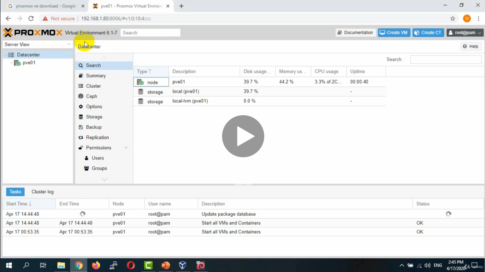
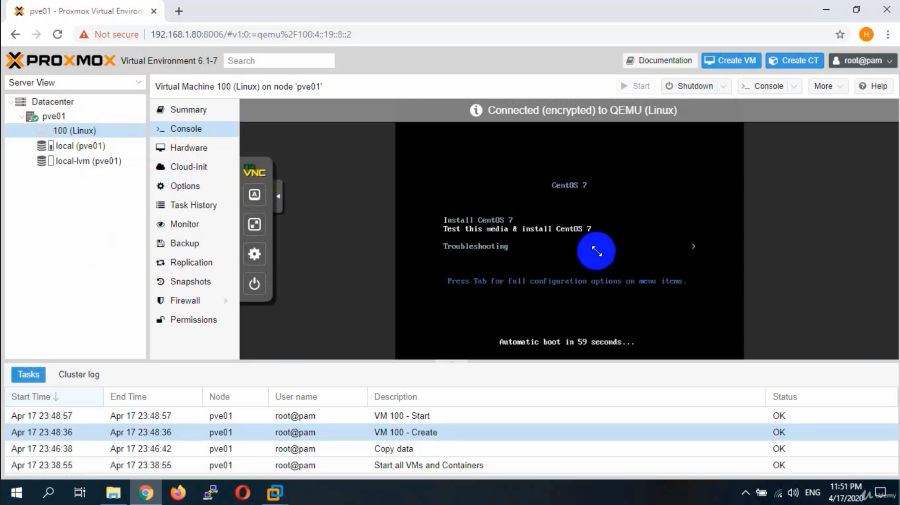
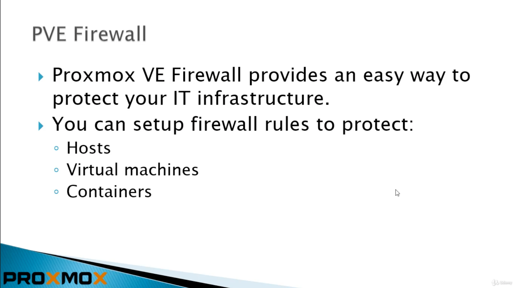

# [Proxmox VE 6](https://www.udemy.com/course/proxmox-ve-5/learn/lecture/19180588#overview)
# Section 1: Proxmox VE 6 - Introduction and Installation
## 1. Introduction
  
## 3. Pre-Installation

## 4. Downloading ISO and Installation

## 5. Proxmox VE and Debian

## 6. Installing Proxmox VE on Debian

- Next need to add repo key

- update repo

skipped

## 7. Conclusion
# Section 2: Web Interface and VM Creation

### Data center contains all proxmox servers
- each server is labelled PVE (proxmox virtual env I guess).
- Datacenters can hold clusters of servers
- If you have HTTP proxy in your datacenter, and need to update servers, access through proxy
  

### Specifying storage

### Replication
- requires more than one node

### Look up
- LXE containers
- Ceph shared storage
- Migration settings
- HA (high availability settings)
## 8. Web Interface
## 9. Create Linux VM
1. Click on "Create VM"

2. Name it Linux

3.  Go to local storage -> content -> upload.

4. Then click create VM
5. Choose OS
6. Choose Graphic card and SCSI controller: defaults
7. Choose HD: set to 4gb (follow formula from previous)
8. CPU: Choose one or 2 sockets, details later
9. Memory: 1gb: 1024
10. Network: choose bridge you'll connect to
11. go over configuration Summary

12. VM created under PVE1, right click and Start

13. click on console to see what's going on

14. continue following instructions for OS install
    1.  Select Disk
    2.  
    3.  Select Network, and turn on
    4.  

### Lookup
- Paravirtualized vs emulated network

## 10. VM Options
## 11. Conclusion
# Section 3: KVM and LXC Containers
## 12. QEMU Hypervisor
## 13. Containers
## 14. Creating Container
## 15. Conclusion
# Section 4: Advanced Devices Configurations
## 16. Prologue
## 17. Advanced Memory Configurations
## 18. Ballooning
## 19. Auto Allocation and Shares
## 20. Disk Formats
## 21. Thick and Thin Provisioning
## 22. Disk Caching Modes
## 23. Disk Additional Options
## 24. Emulated and Paravirtualized Devices
# Section 5: Network Configurations
## 25. Prologue
## 26. Add NIC
## 27. Bridges
## 28. Apply Configurations Button
## 29. Apply Configurations Without Restart
## 30. Naming Conventions
## 31. Bonding
## 32. Bonding Practical Lab
# Section 6: Storage Management
## 33. Prologue
## 34. Default Storages
## 35. Directory Storage
## 36. LVM and LVM Thin
## 37. Extend LVM or LVM Thin Size
## 38. CIFS Storage
## 39. NFS Storage
## 40. iSCSI Storage
# Section 7: Firewall
## 41. Prologue

## 42. Introduction

## 43. Hands-On-Lab

1. check service of PVE firewall service

2. check PVE firewall Status

3. You see that it's running, but disabled.  No rules activated yet

4. Datacenter -> Options -> Firewall -> enable = No

5. Don't activate yet, set rules first

6. Enable traffic with params below

## 44. Lab Summary
## 45. Configuration Files
## 46. Rules and Macros
## 47. Aliases
## 48. IPSets
## 49. Security Groups
## 50. Firewall Logs
## 51. Services and Commands
## 52. Firewall and FTP
## 53. Suricata IPS Integration
## 54. Proxmox VE Ports
## 55. Conclusion
# Section 8: Backup and Restore
## 56. Prologue
## 57. Making Backups
## 58. Backup Modes
## 59. Restoring Backups
## 60. Snapshots
## 61. Cloning
## 62. Templates
# Section 9: Users and Privileges
## 63. Prologue
## 64. Introduction
## 65. PAM Authentication
## 66. PVE Authentication
## 67. LDAP and Micrososft AD
## 68. Roles and Privileges
## 69. Grant Privileges
## 70. Storage Privileges
## 71. Paths
## 72. Pools and Groups
## 73. Two Factor Authentication
# Section 10: Proxmox Clusters
## 74. Prologue
## 75. Introduction
## 76. Requirements
## 77. Preparing Nodes
## 78. Installing Additional Nodes
## 79. Create Cluster
## 80. Cluster Status
## 81. Deleting Nodes
## 82. Quorum
## 83. Cluster Filesystem
## 84. Cluster Network
## 85. VM Online Migration
# Section 11: Shared Storage and High Availability
## 86. Prologue
## 87. Introduction
## 88. Local Storage
## 89. Shared Storage
## 90. Shared Storage Example
## 91. Testing High Availability
# Section 12: CEPH Shared Storage
## 92. Prologue
## 93. Introduction
## 94. Adding New Disks
## 95. Installing CEPH
## 96. Create Monitors
## 97. Creating OSDs
## 98. Pools and HA
## 99. CEPH Health
## 100. Self Healing
## 101. Adding Disks after Disk Failure
## 102. ISO Files Problem
# Section 13: GlusterFS Storage
## 103. Prologue
## 104. Installing GlusterFS
## 105. Probes and Creating Volume
## 106. Adding Storage
## 107. Practical Lab
## 108. GlusterFS for VM Disk
# Section 14: ZFS Storage and Replication
## 109. Introduction
## 110. Installing Proxmox on ZFS Storage
## 111. Create ZFS from GUI
## 112. Preparing for Replication
## 113. Start Replication
## 114. Creating ZFS Pool from CLI
## 115. Increase Pool SPace
## 116. Replcaing Disk and Email Notifications
# Section 15: Proxmox VE Services
## 117. PVE Services
# Section 16: Command Line Interface
## 118. Command Line Interface
# Section 17: Proxmox VE API
## 119. Proxmox VE API
# Section 18: Billing Systems and Automation
## 120. Billing and Automation
# Section 19: Proxmox VE 5 Legacy Sections - will be retired in 2021
## 121. Proxmox Cluster
## 122. High Availability