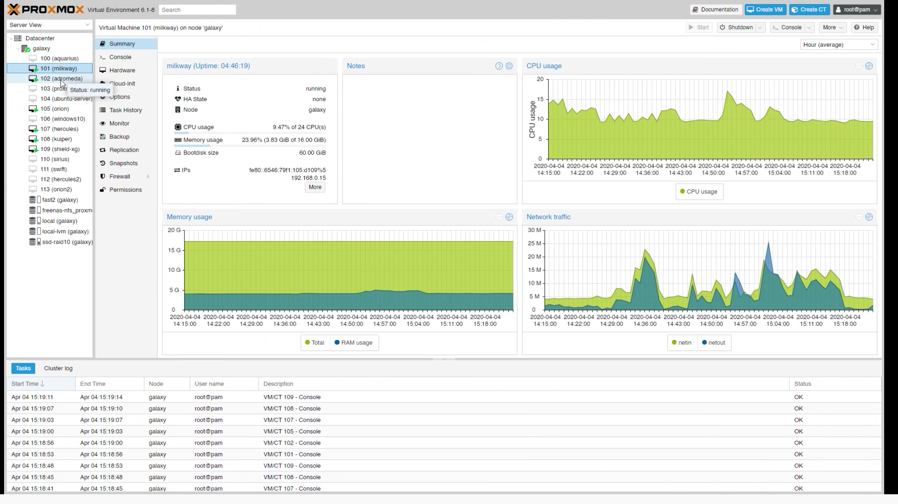
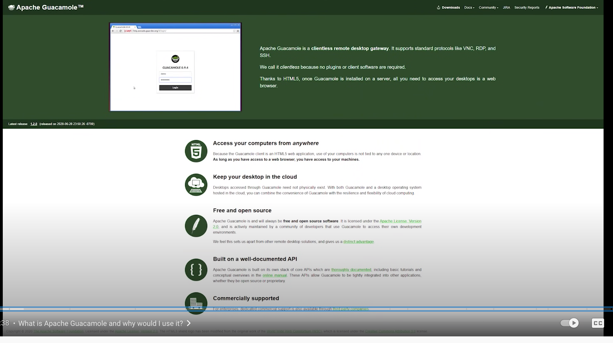
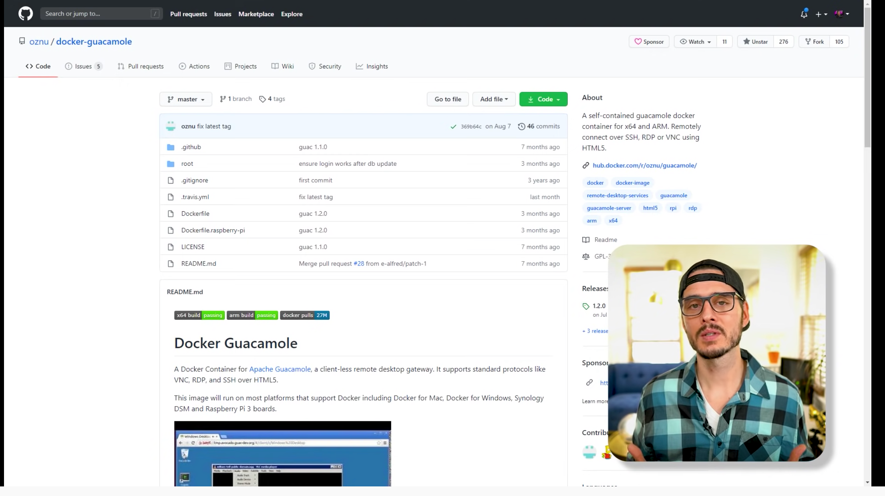
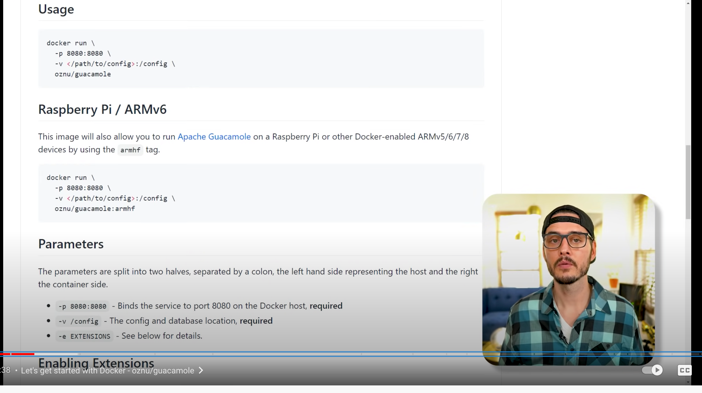
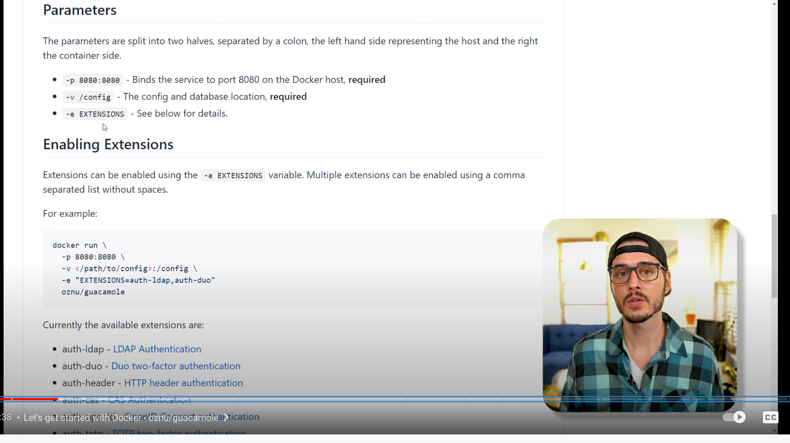
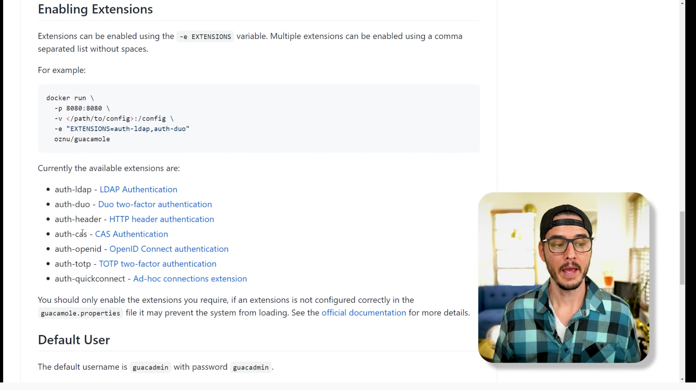

# [Self hosted remote access gateway: Guacamole](https://www.youtube.com/watch?v=LWdxhZyHT_8&t=277s)
## Use to remote into proxmox server

- Say you've spun up lots of VMs

- typically you have these installed to help with remoting
  - VNC client
  - SSH client (putty)
  - Remote Desktop client

- Which is cool, until you move to another machine, which you have to set all of the above all over again

- Guacamole: a clientless remote desktop gateway.  Clientless meaning it uses standard protocols, RDP, VNC, SSH.  Which are already supported by Operating systems

- works in any browser with no plugins

## Setup using Docker, then Rancher
- Rancher: spins up Kubernetes, which then gives docker

1. go to github page to get docker image

2. take a look at Commands

3. Look at environment variable in parameters

4. Look at extensions

5. this enables authentication

### Lookup
- VNC client